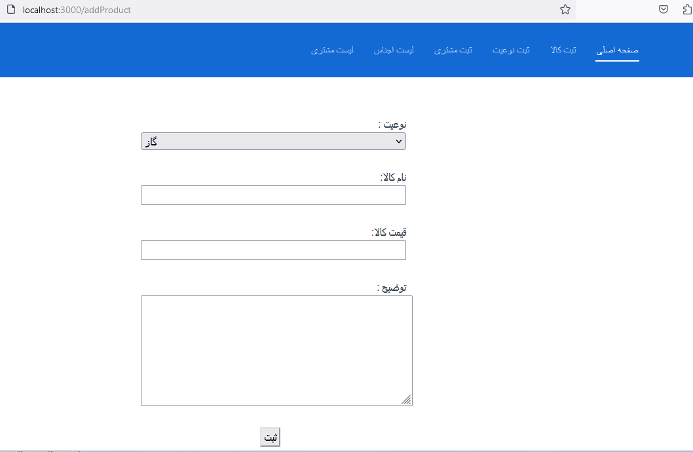
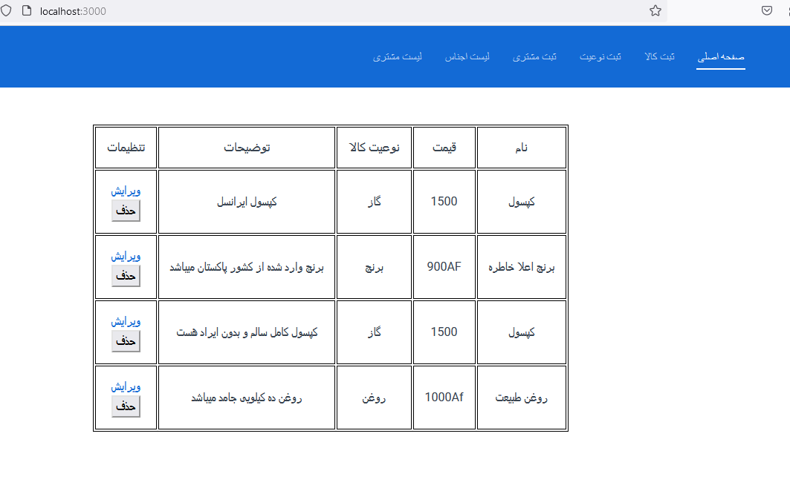
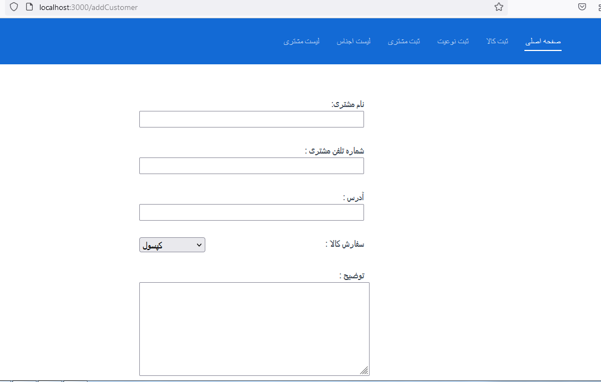
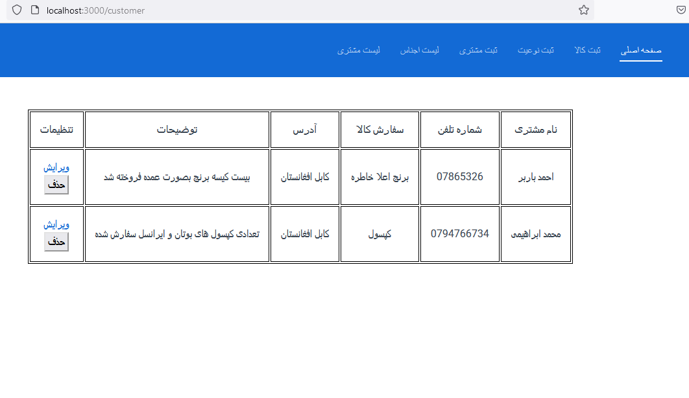

# 📊 StockClient

**Description:**  
StockClient is a simple inventory management system. Admins can add, edit, and delete products to manage stock efficiently.

---

## ✨ Features

- 🗂 Manage products and inventory  
- ➕ Add, edit, delete products
- ➕ Add, edit, delete customers
- 📱 Responsive design for desktop & mobile  

---

## 🛠 Tech Stack

- **Frontend:** HTML, CSS, JavaScript, Vue.js  
- **Backend:** Node.js, Express.js  
- **Database:** SQL  
- **Tools:** Git, GitHub, VS Code  

---

## Some ScreenShots




## ⚡ Installation

```bash
git clone https://github.com/username/StockClient.git
cd StockClient
npm install
npm start
